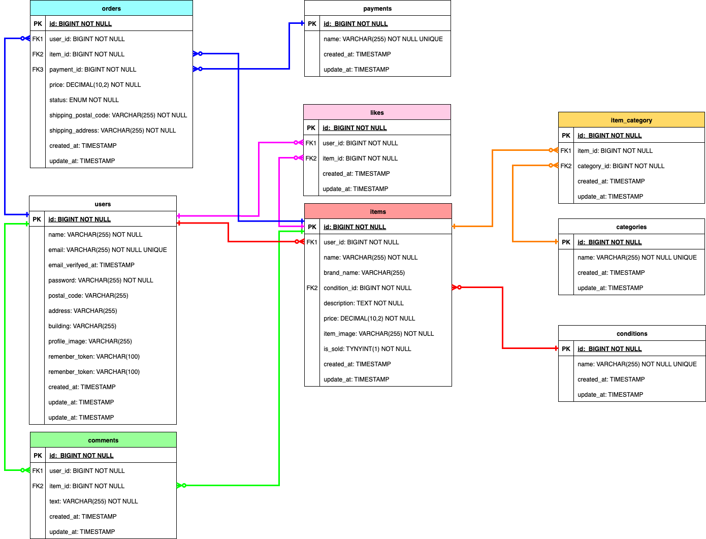

# coachtech フリマ

フリーマーケットアプリケーション

## 環境構築

### 必要なソフトウェア

- **Git**: リポジトリのクローン用
- **Docker**: コンテナ実行環境
- **Docker Compose**: マルチコンテナ管理

**注意**: PHP / Laravel / MySQL は Docker コンテナ内で動作します。Node.js は本リポジトリのコンテナには含まれていないため、フロントのビルドが必要な場合はホスト側に Node.js を用意してください。
補足：本アプリは `public/js` の素のJavaScriptも利用していますが、**テスト実行や通常利用に Node.js は必須ではありません。**

### Docker ビルド

1. リポジトリをクローン

```bash
git clone https://github.com/pon02/coachtech-flea-market.git
cd coachtech-flea-market
```

2. Docker コンテナをビルド・起動

```bash
docker compose up -d --build
```

3. コンテナの起動確認

```bash
docker compose ps
```

### Laravel 環境構築

1. PHP コンテナに入る

```bash
docker compose exec php bash
```

2. 依存関係をインストール

```bash
composer install
```

3. 環境変数ファイルをコピー

```bash
cp .env.example .env
```
**※重要**: `cp .env.example .env` 後、DB設定は必ず手入力してください（DockerのMySQL設定に合わせる）

※ MailHog（メール送信テスト）で「An email must have a "From" or a "Sender" header.」が出る場合は、送信元が未設定です。
このリポジトリの `src/.env.example` では `MAIL_FROM_ADDRESS` を設定済みなので、上記コピー後に `src/.env` に `MAIL_FROM_ADDRESS` が入っていることを確認してください。

4. アプリケーションキーを生成

```bash
php artisan key:generate
```

5. データベースをマイグレーション・シード

```bash
php artisan migrate --seed
```

6. ストレージリンクを作成

```bash
php artisan storage:link
```

※ Docker環境では、PHPコンテナ起動時に `storage` / `bootstrap/cache` の書き込み権限を自動調整し、必要なら `storage:link` も自動作成します。
そのため通常この手順は不要ですが、すでに `public/storage` が存在する場合などはスキップされます。

7. フロントエンドアセットをビルド

（任意）フロントエンドの依存を入れる場合（ホスト側で `src/` に移動して実行）

```bash
npm install
```

```bash
npm run dev
```

※ 画面表示用のCSS/JSがすでに配置されているため、**動作確認やテストだけならこの手順はスキップ可能**です。

## 使用技術（実行環境）

### バックエンド

- **PHP**: 8.1
- **Laravel**: 9.x
- **MySQL**: 8.0

### フロントエンド

- **HTML/CSS/JavaScript**
- **Laravel Mix**

### 認証

- **Laravel Fortify**: メール認証機能

### 決済

- **Stripe**: クレジットカード決済

### 開発環境

- **Docker**: コンテナ化
- **Docker Compose**: マルチコンテナ管理
- **Nginx**: Web サーバー
- **phpMyAdmin**: データベース管理
- **MailHog**: メール送信テスト

### テスト

- **PHPUnit**: 統合テスト

## ER 図



## URL

### 開発環境

- **アプリケーション**: http://localhost
- **phpMyAdmin**: http://localhost:8080
- **MailHog**: http://localhost:8025

### 主要な機能 URL

- **トップページ**: http://localhost/
- **会員登録**: http://localhost/register
- **ログイン**: http://localhost/login
- **商品出品**: http://localhost/sell
- **マイページ**: http://localhost/mypage
- **取引チャット**: http://localhost/trade

## 機能一覧

### 認証機能

- 会員登録
- メール認証
- ログイン・ログアウト
- プロフィール設定

### 商品機能

- 商品一覧表示
- 商品詳細表示
- 商品検索
- 商品出品
- カテゴリ分類

### 購入機能

- 商品購入
- 決済（コンビニ決済・Stripe 決済）
- 配送先設定
- 購入履歴

### ソーシャル機能

- いいね機能
- コメント機能
- マイリスト
- 取引チャット機能

## 動作確認用ユーザー

アプリケーションの動作確認のため、Seeder で作成している以下のデモアカウントをご利用ください：

| ユーザー名 | メールアドレス     | パスワード | 出品商品 |
| ---------- | ------------------ | ---------- | --------- |
| tanaka     | tanaka@example.com | 12345678   | CO01〜05 |
| yamada     | yamada@example.com | 12345678   | CO06〜10 |
| suzuki     | suzuki@example.com | 12345678   | 出品なし |

**※注意**: これらはデモ用アカウントです。本番環境では使用しないでください。

## テスト

### テスト実行前の準備（初回のみ）

このリポジトリは MySQL を使用します。テストは `laravel_test_db` データベースを使うため、初回は DB を作成し、`.env.testing` を準備してください。

1) `.env.testing` を作成

```bash
# src/.env.testing を作成（テスト環境）
docker compose exec -T php cp .env.example .env.testing
```

2) APP_KEY を生成（テスト）

```bash
docker compose exec -T php php artisan key:generate --env=testing
```

3) テスト用DBを作成（`laravel_test_db`）

```bash
docker compose exec -T mysql mysql -uroot -pdev_root_pass -e "CREATE DATABASE IF NOT EXISTS laravel_test_db; GRANT ALL PRIVILEGES ON laravel_test_db.* TO 'laravel_user'@'%'; FLUSH PRIVILEGES;"
```

4) 接続確認（任意）

```bash
docker compose exec -T php php artisan migrate:fresh --seed --env=testing
```

※ もし `storage` / `bootstrap/cache` の権限エラーが出る場合のみ、以下を実行してください。

```bash
docker compose exec -T php sh -lc 'chown -R www-data:www-data storage bootstrap/cache 2>/dev/null || true; chmod -R ug+rwX storage bootstrap/cache'
```

※上記の権限調整は「ローカル開発用」です。本番環境ではアプリの実行ユーザーを固定し、必要最小限の権限設定にしてください。

```bash
# 全テスト実行
docker compose exec -T php php artisan test --env=testing

# Featureテストのみ実行
docker compose exec -T php php artisan test --env=testing --testsuite=Feature

# 特定のテストファイルを実行
docker compose exec -T php php artisan test --env=testing tests/Feature/Auth/LoginTest.php
```
